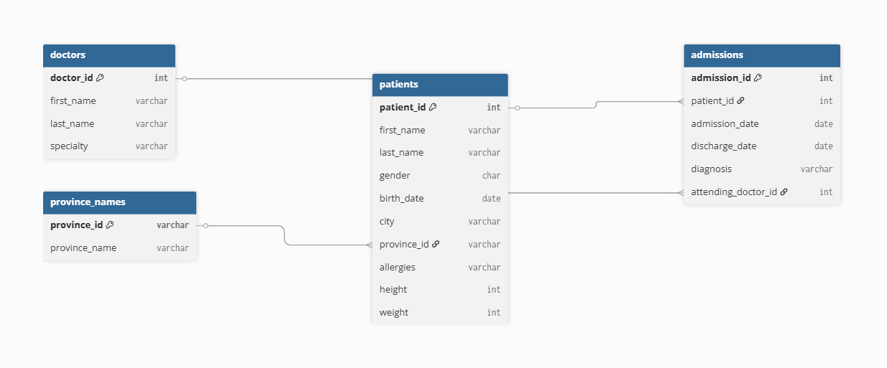
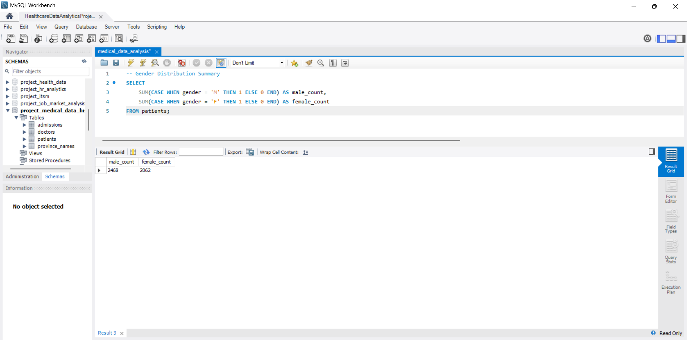
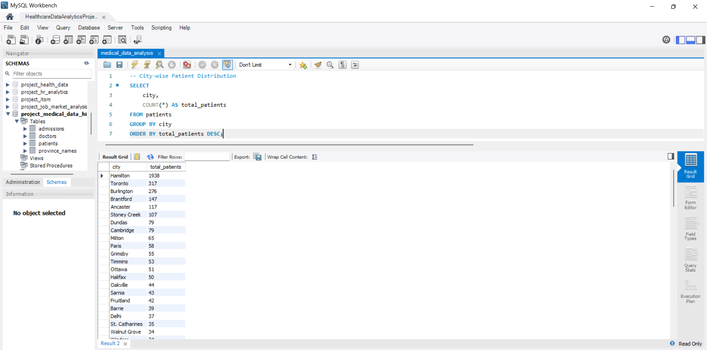
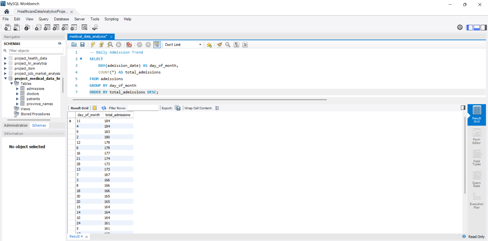
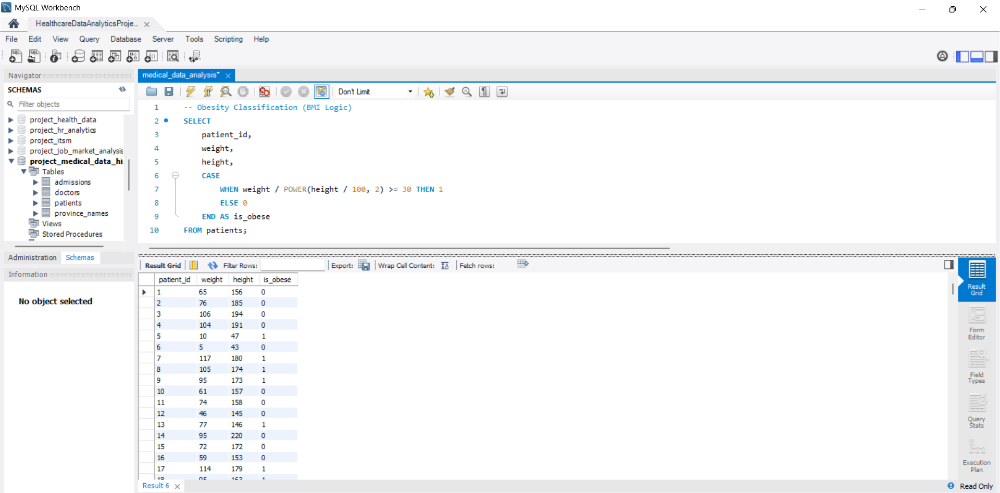
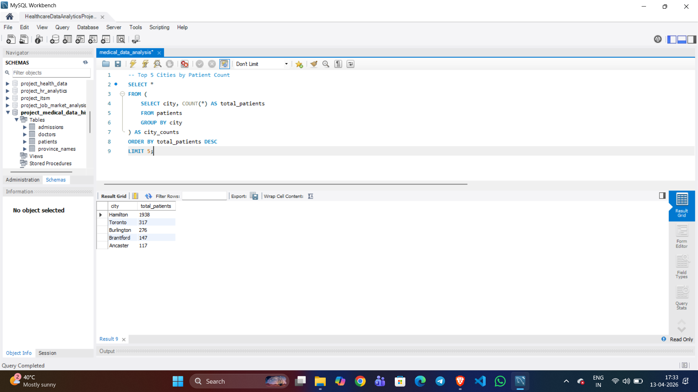

# 🏥 Healthcare Data Analytics & Patient Insights using SQL

---

## 📌 Overview

This project delivers an end-to-end healthcare data analysis using SQL, focusing on extracting actionable insights from patient records and hospital admissions.  
It demonstrates a real-world analytical workflow including data exploration, cleaning, transformation, and business-driven insights.

The SQL queries are structured using business-oriented problem statements, reflecting practical analytics scenarios rather than simple task execution.

---

## 🎯 Business Problem

Healthcare systems generate vast amounts of structured data, but without proper analysis, it is difficult to:

- Understand patient demographics and regional distribution  
- Identify hospital admission trends and operational load  
- Detect repeated diagnoses and chronic conditions  
- Handle missing or inconsistent data  

This project solves these challenges by transforming raw healthcare data into meaningful insights that support data-driven decision-making.

---

## 📊 Dataset Overview

The project uses four relational datasets:

### 🔹 patients
- Patient ID, Name, Gender  
- Birth Date, City, Province  
- Allergies, Height, Weight  

### 🔹 admissions
- Patient ID  
- Admission & Discharge Dates  
- Diagnosis  
- Attending Doctor ID  

### 🔹 doctors
- Doctor ID  
- Name  
- Specialty  

### 🔹 province_names
- Province ID  
- Province Name  

📘 Detailed column descriptions available in: `data_dictionary.md`

---

## 🧠 SQL Skills Demonstrated

- Joins (multi-table relational analysis)  
- Aggregations (COUNT, SUM, GROUP BY, HAVING)  
- Subqueries (nested filtering)  
- Data Cleaning (handling NULL values, standardization)  
- Conditional Logic (CASE statements for classification)  
- String Functions (CONCAT, UPPER, LOWER)  
- Date Functions (YEAR, DAY)  

---

## 📈 Key Insights

- Patient distribution is balanced across genders, indicating no major demographic skew  
- Certain cities show significantly higher patient concentration, highlighting regional healthcare demand  
- Repeated admissions for the same diagnosis suggest the presence of chronic conditions  
- Same-day admissions and discharges indicate minor or quick-treatment cases  
- Missing allergy data was standardized using 'NKA', improving data consistency  
- BMI-based analysis identified a subset of patients classified as obese  
- Age distribution enables demographic segmentation for targeted healthcare strategies  
- Diagnosis-specific analysis (e.g., Dementia, Epilepsy) reveals relationships between patients and doctor specialties  

---

## 📌 Business Recommendations

- Allocate more healthcare resources to high patient-density cities  
- Monitor patients with repeated admissions for chronic disease management  
- Implement preventive care programs based on BMI and obesity trends  
- Improve data collection processes to reduce missing medical information  

---

## 🧩 Data Model (ER Diagram)



---

## 📊 Sample Outputs

### Gender Distribution


### City-wise Patient Distribution


### Daily Admission Trends


### Obesity Classification


### Top Cities by Patient Count


---

## 📂 Project Structure

```bash
healthcare-data-analytics-sql/
│
├── sql/
│   ├── medical_data_analysis.sql
│   ├── execution_instructions.txt
│   └── schema.sql
│
├── datasets/
│   ├── patients.csv
│   ├── admissions.csv
│   ├── doctors.csv
│   └── province_names.csv
│
├── outputs/
│   ├── gender_distribution.png
│   ├── city_patient_distribution.png
│   ├── daily_admission_trends.png
│   ├── obesity_classification.png
│   ├── top_cities.png
│   ├── epilepsy_doctor_analysis.png
│   └── repeated_diagnosis.png
│
├── assets/
│   └── er_diagram.png
│
├── data_dictionary.md
└── README.md
```

---

## 🚀 How to Run

### Step 1 — Create Database

```sql
CREATE DATABASE healthcare_db;
USE healthcare_db;
```

### Step 2 — Create Tables

- Open: `sql/schema.sql`  
- Execute the script to create all tables along with relationships  

### Step 3 — Import Datasets

- Import CSV files from the `datasets/` folder  
- Use **MySQL Workbench → Table Data Import Wizard**  

### Step 4 — Execute SQL Analysis

- Open: `sql/medical_data_analysis.sql`  
- Run queries section by section  

### Step 5 — Refer Execution Guide

- Detailed steps available in: `sql/execution_instructions.txt`  

---

## 🔐 Data Privacy Note

All sensitive database credentials have been removed to ensure security best practices.  
Users must configure their own local database environment before executing the queries.

---

## 📌 Important Note

- GitHub cannot execute SQL files  
- All queries must be run locally using a database system such as MySQL  
